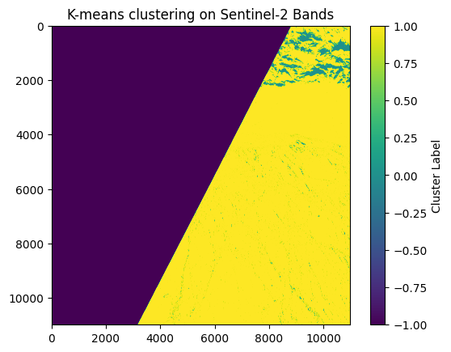
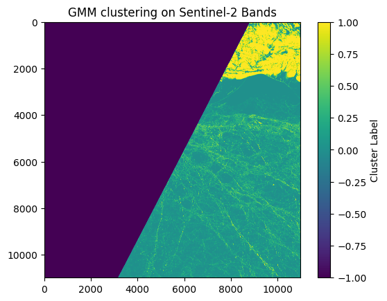
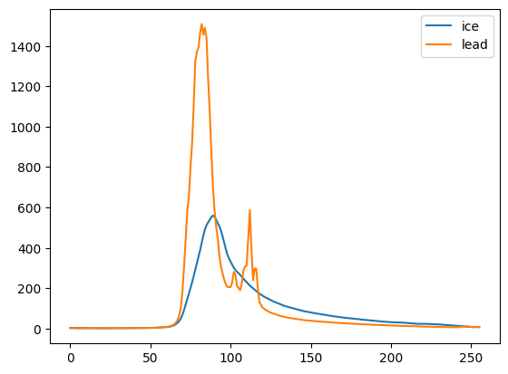
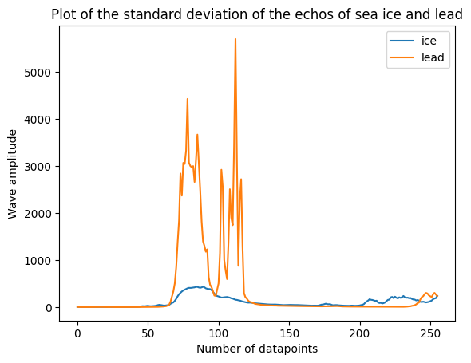

# GEOL0069Week4

This project focuses on providing a **practical implementation** of unsupervised learning methods for **classifying sea ice and leads** using **Sentinel-2 imagery and Sentinel-3 altimetry data**.

## Overview

The project implements two unsupervised learning methods - K-means clustering and Gaussian Mixture Models (GMM) to:

- Distinguish between sea ice and leads in Sentinel-2 imagery
- Classify echoes in Sentinel-3 altimetry data
- Analyze echo shapes and standard deviations for different classes
- Evaluate classification performance using confusion matrix

The results demonstrate the effectiveness of unsupervised learning in distinguishing different surface types in satellite data.

## Contents

- **Part 1: Sentinel-2 Classification**
  - K-means clustering implementation
  - GMM implementation
  - Visual comparison of results
  
- **Part 2: Sentinel-3 Altimetry Analysis**
  - Data preprocessing and feature extraction
  - Echo classification using GMM
  - Analysis of echo shapes and standard deviations
  - Performance evaluation using confusion matrix

## Getting Started

To get started with this project, clone the repository to your local machine:

```bash
git clone https://github.com/Shizhe030120/GEOL0069Week4.git
```

Navigate to the project directory:

```bash
cd GEOL0069Week4
```

## Usage

The project uses Python with several key libraries. Here are some example visualizations and their interpretations:

### Sentinel-2 Classification Results

```python
import rasterio
import numpy as np
from sklearn.cluster import KMeans
import matplotlib.pyplot as plt

base_path = "/content/drive/MyDrive/Teaching_Michel/GEOL0069/StudentFolder/Week_4/S2A_MSIL1C_20190301T235611_N0207_R116_T01WCU_20190302T014622.SAFE/GRANULE/L1C_T01WCU_A019275_20190301T235610/IMG_DATA/" # You need to specify the path
bands_paths = {
    'B4': base_path + 'T01WCU_20190301T235611_B04.jp2',
    'B3': base_path + 'T01WCU_20190301T235611_B03.jp2',
    'B2': base_path + 'T01WCU_20190301T235611_B02.jp2'
}

# Read and stack the band images
band_data = []
for band in ['B4', 'B3', 'B2']:
    with rasterio.open(bands_paths[band]) as src:
        band_data.append(src.read(1))

# Stack bands and create a mask for valid data (non-zero values in all bands)
band_stack = np.dstack(band_data)
valid_data_mask = np.all(band_stack > 0, axis=2)

# Reshape for K-means, only including valid data
X = band_stack[valid_data_mask].reshape((-1, 3))

# K-means clustering
kmeans = KMeans(n_clusters=2, random_state=0).fit(X)
labels = kmeans.labels_

# Create an empty array for the result, filled with a no-data value (e.g., -1)
labels_image = np.full(band_stack.shape[:2], -1, dtype=int)

# Place cluster labels in the locations corresponding to valid data
labels_image[valid_data_mask] = labels

# Plotting the result
plt.imshow(labels_image, cmap='viridis')
plt.title('K-means clustering on Sentinel-2 Bands')
plt.colorbar(label='Cluster Label')
plt.show()
```
K-means clustering result:


```python
import rasterio
import numpy as np
from sklearn.mixture import GaussianMixture
import matplotlib.pyplot as plt

# Paths to the band images
base_path = "/content/drive/MyDrive/Teaching_Michel/GEOL0069/StudentFolder/Week_4/S2A_MSIL1C_20190301T235611_N0207_R116_T01WCU_20190302T014622.SAFE/GRANULE/L1C_T01WCU_A019275_20190301T235610/IMG_DATA/" # You need to specify the path
bands_paths = {
    'B4': base_path + 'T01WCU_20190301T235611_B04.jp2',
    'B3': base_path + 'T01WCU_20190301T235611_B03.jp2',
    'B2': base_path + 'T01WCU_20190301T235611_B02.jp2'
}

# Read and stack the band images
band_data = []
for band in ['B4', 'B3', 'B2']:
    with rasterio.open(bands_paths[band]) as src:
        band_data.append(src.read(1))

# Stack bands and create a mask for valid data (non-zero values in all bands)
band_stack = np.dstack(band_data)
valid_data_mask = np.all(band_stack > 0, axis=2)

# Reshape for GMM, only including valid data
X = band_stack[valid_data_mask].reshape((-1, 3))

# GMM clustering
gmm = GaussianMixture(n_components=2, random_state=0).fit(X)
labels = gmm.predict(X)

# Create an empty array for the result, filled with a no-data value (e.g., -1)
labels_image = np.full(band_stack.shape[:2], -1, dtype=int)

# Place GMM labels in the locations corresponding to valid data
labels_image[valid_data_mask] = labels

# Plotting the result
plt.imshow(labels_image, cmap='viridis')
plt.title('GMM clustering on Sentinel-2 Bands')
plt.colorbar(label='Cluster Label')
plt.show()
```

GMM classification result:


### Echo Analysis Results

```python
path = '/content/drive/MyDrive/Teaching_Michel/GEOL0069/StudentFolder/Week_4/' # You need to specify the path
SAR_file='S3B_SR_2_LAN_SI_20190301T231304_20190301T233006_20230405T162425_1021_022_301______LN3_R_NT_005.SEN3'
print('overlapping SAR file is',SAR_file)
SAR_data=Dataset(path + SAR_file+'/ .nc')

SAR_lat, SAR_lon, waves, sig_0, RIP, flag = unpack_gpod('lat_20_ku'), unpack_gpod('lon_20_ku'), unpack_gpod('waveform_20_ku'),unpack_gpod('sig0_water_20_ku'),unpack_gpod('rip_20_ku'),unpack_gpod('surf_type_class_20_ku') #unpack_gpod('Sigma0_20Hz')
SAR_index=np.arange(np.size(SAR_lat))

find=np.where(SAR_lat >= -99999)#60
SAR_lat=SAR_lat[find]
SAR_lon=SAR_lon[find]
SAR_index=SAR_index[find]
waves=waves[find]
sig_0=sig_0[find]
RIP=RIP[find]

PP=peakiness(waves)
SSD=calculate_SSD(RIP)
sig_0_np = np.array(sig_0)  # Replace [...] with your data
RIP_np = np.array(RIP)
PP_np = np.array(PP)
SSD_np = np.array(SSD)

data = np.column_stack((sig_0_np,PP_np, SSD_np))
# Standardize the data
scaler = StandardScaler()
data_normalized = scaler.fit_transform(data)

plt.plot(np.mean(waves_cleaned[clusters_gmm==0],axis=0),label='ice')
plt.plot(np.mean(waves_cleaned[clusters_gmm==1],axis=0),label='lead')
plt.legend()
```

Average echo shapes:


```python
plt.plot(np.std(waves_cleaned[clusters_gmm==0],axis=0),label='ice')
plt.plot(np.std(waves_cleaned[clusters_gmm==1],axis=0),label='lead')
plt.title('Plot of the standard deviation of the echos of sea ice and lead')
plt.xlabel('Number of datapoints')
plt.ylabel('Wave amplitude')
plt.legend()
```

Standard deviations:


## Performance

The classification performance was evaluated using a confusion matrix comparing GMM results with ESA official classification:

The model achieved an impressive accuracy of 0.99, with:
- Precision: 1.00 for sea ice, 0.96 for leads
- Recall: 0.99 for sea ice, 1.00 for leads
- F1-score: 0.99 for sea ice, 0.98 for leads

These metrics demonstrate the high reliability of our unsupervised learning approach in distinguishing between sea ice and leads.

## Contributing

If you would like to contribute to this repository, feel free to fork the repository, create a branch, and submit a pull request with your changes. All contributions are welcome!